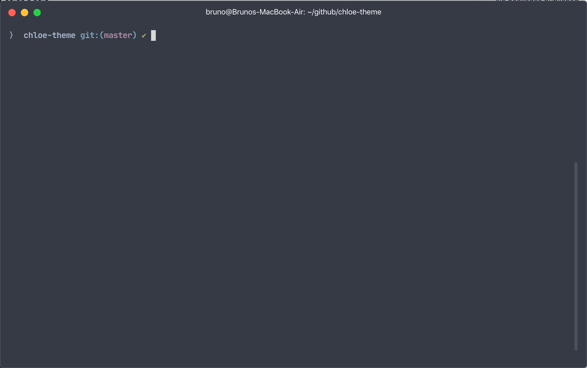

# Chloe Theme

This is my simple oh my zsh theme based on robbyrussell default theme.

To install: 

<code>
  $ git clone https://github.com/BrunoMoreno/chloe-theme.git
</code>

<code>
$ cd chloe-theme && cp chloe.zsh-theme ~/.oh-my-zsh/themes/
</code>

Change in .zshrc:

<code>
  ZSH_THEME="chloe"
</code>

Now reload your terminal:

<code>
  $ source .zshrc
</code>

#### See the result:

#### In a git branch:

I recomend use the JetBrains Mono font:
[Get it here](https://www.jetbrains.com/lp/mono/)

Enjoy It!

